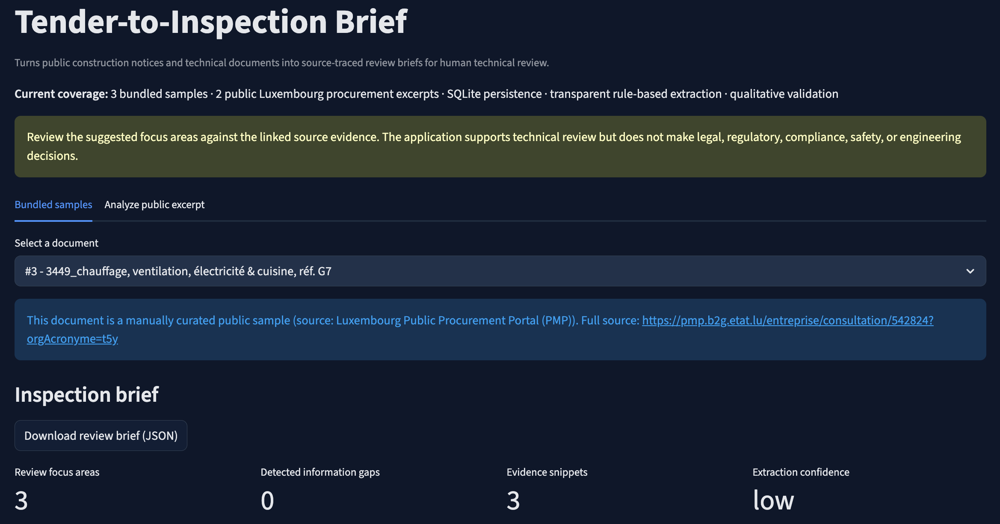
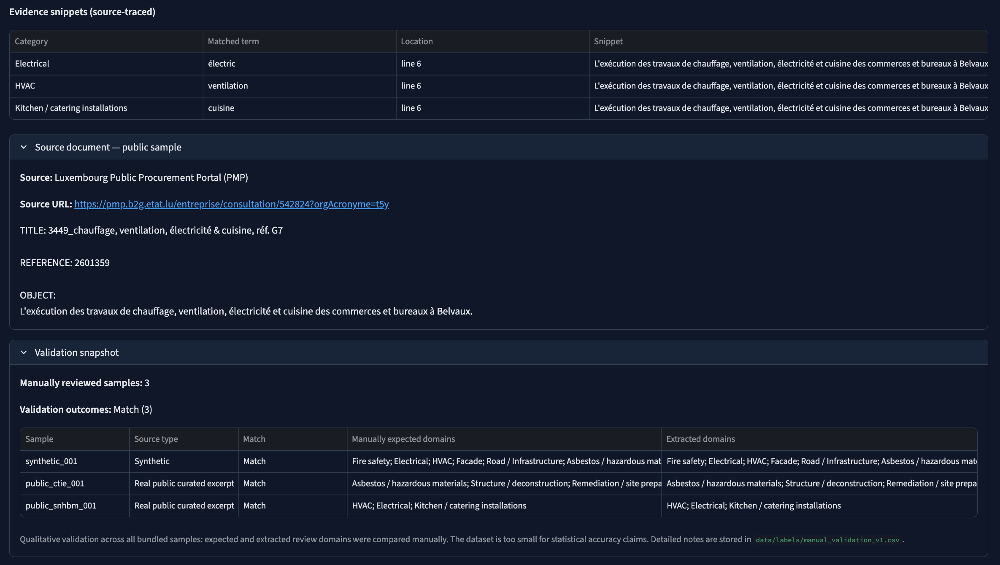
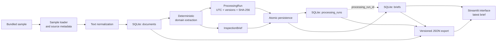

# Tender-to-Inspection Brief

Tender-to-Inspection Brief turns public construction tender excerpts into structured, source-traced technical review briefs.

The application helps technical reviewers identify relevant work scopes, surface missing or unclear information, prepare follow-up questions, and trace detected review domains back to the source text. It supports human technical review and does not make legal, compliance, safety, regulatory, or engineering decisions.

**Live application:** https://tender-inspection-app.streamlit.app

**Stack:** Python · Streamlit · SQLite · Pydantic · pytest · GitHub Actions





## Key capabilities

- Generates structured technical review briefs from bundled or pasted public tender excerpts.
- Links detected review domains to source-labeled evidence and presents information gaps and reviewer questions separately.
- Persists documents, processing runs, and linked briefs in SQLite with explicit provenance and preserved history.
- Exports persisted briefs as deterministic, versioned JSON.
- Runs fully offline on bundled samples without API keys or external services.
- Uses automated tests and a committed qualitative validation set to detect regressions.

## Purpose and reviewer workflow

Public construction tender documents can contain technical signals such as declared work scopes, referenced surveys, site constraints, specialist interfaces, and missing attachments. These details may be distributed across the source and take time to review manually.

The application provides a structured first pass for technical reviewers and inspection coordinators. It helps identify domains requiring attention, locate supporting evidence, highlight information gaps, prepare follow-up questions, and transfer a persisted result with its processing metadata.

The reviewer remains responsible for confirming the findings, interpreting the source material, and deciding what requires follow-up.

## Scope

The application focuses on early technical-review preparation for public construction tender notices and excerpts. It prioritizes transparent processing, structured records, source traceability, reproducible execution, explicit versioning, and human review.

It does not replace specialist judgment or provide document management, BIM coordination, site-inspection records, defect tracking, or regulatory assessment.

## Data sources

Three bundled samples are committed under `data/samples/` and can be processed without network access.

| File                                  | Type                   | Source                                                                                                                                                                                              |
| ------------------------------------- | ---------------------- | --------------------------------------------------------------------------------------------------------------------------------------------------------------------------------------------------- |
| `synthetic_sample_tender_001.txt`     | Synthetic              | Hand-written offline test fixture; not a real tender.                                                                                                                                               |
| `public_lu_pmp_ctie_001.txt`          | Curated public excerpt | Luxembourg Public Procurement Portal / TED-linked public notice. Buyer: Administration des bâtiments publics. TED notice reference: 217578-2026. Asbestos remediation and selective deconstruction. |
| `public_lu_pmp_snhbm_belvaux_001.txt` | Curated public excerpt | Luxembourg Public Procurement Portal. Buyer: SNHBM – Société Nationale des Habitations à Bon Marché. Reference: 2601359. Heating, ventilation, electrical, and kitchen works in Belvaux.            |

The public samples are short manually curated excerpts from real Luxembourg public procurement consultations. No scraping was performed, and no full tender dossier was downloaded or committed. Public source URLs and reference metadata are recorded in the sample headers.

The CTIE sample covers asbestos remediation and selective deconstruction. The SNHBM Belvaux sample broadens coverage to building-services work, including heating, ventilation, electrical, and kitchen installations.

The synthetic sample remains the default deterministic fixture for offline testing.

## Analyze a public excerpt

The Streamlit interface includes an **Analyze public excerpt** tab. A user can paste a short public tender or document excerpt and generate a preview through the same cleaning and extraction path used for bundled samples.

This path is intended only for public, non-confidential text. Pasted content is processed in the current session and is not stored. The application does not fetch supplied URLs, scrape websites, parse PDFs, or call an external model or API. Arbitrary pasted excerpts are not covered by the bundled validation set, and every result requires human technical review.

## Processing pipeline

The pipeline is implemented as a single Python module and does not require external services.

1. **Load** — `src/collect/sample_loader.py` reads a bundled sample and parses source metadata such as `SOURCE`, `SOURCE_URL`, `TED_NOTICE`, and `REFERENCE`.
2. **Clean** — `src/parse/clean.py` normalizes whitespace and encoding.
3. **Store document** — The current logical document record is stored in the SQLite `documents` table. Reprocessing reuses the document identified by `(source, title)` and refreshes its current content.
4. **Extract** — `src/ai/risk_extract.py` applies a transparent keyword-to-domain classification baseline and returns a structured `InspectionBrief`.
5. **Record processing run** — `src/provenance.py` creates metadata containing a UTC timestamp, extractor name and version, brief schema version, and SHA-256 fingerprint of the normalized source text.
6. **Persist atomically** — The processing run and its linked brief are inserted in one transaction. Previous runs and briefs remain stored.
7. **Display latest result** — The Streamlit interface retrieves the latest persisted brief for the selected document.
8. **Export persisted result** — The application combines the selected document, its linked processing run, and its structured brief into a versioned JSON download.



## Extraction and evidence traceability

`src/ai/risk_extract.py` implements a deterministic keyword-to-domain classification baseline.

The extractor scans normalized source text case-insensitively and maps matched terms to technical review domains. For example, a fire-related term may trigger `Fire safety`, while `amiant` may trigger `Asbestos / hazardous materials`.

The structured `InspectionBrief` contains:

* `summary` — a short neutral description;
* `technical_scopes` — detected technical scopes;
* `risk_domains` — potential review focus areas;
* `missing_info` — detected information gaps;
* `review_questions` — suggested follow-up questions;
* `evidence` — source snippets, matched terms, and approximate locations;
* `confidence` — currently set to `low`;
* `human_review_required` — always set to `true`.

Each `EvidenceSnippet` records:

* the relevant source line;
* the term that triggered the match;
* an approximate line location.

When a term appears in both a title and a later body line, the extractor prefers the body line because it usually provides more useful context. The title remains a fallback when no suitable body line is available.

### French-language coverage

A small targeted set of French construction terms supports the bundled Luxembourg public samples. It covers the current asbestos, deconstruction, heating, ventilation, electrical, and kitchen examples.

This is not general multilingual natural-language processing. The baseline can miss French paraphrases, broader technical terminology, and French-language missing-information signals.

## Processing provenance and persistence

The SQLite database maintains three principal tables:

* `documents` — the current source record for each logical document;
* `processing_runs` — metadata for every persisted processing execution;
* `briefs` — structured results linked to their document and exact processing run.

Each processing run records:

* document ID;
* timezone-aware UTC processing timestamp;
* extractor name;
* extractor version;
* brief schema version;
* SHA-256 fingerprint of the normalized source text.

Each brief is linked to exactly one processing run through `processing_run_id`. Reprocessing preserves earlier runs and briefs while the interface continues to display the latest result.

Processing-run and brief insertion is atomic: if either record cannot be persisted, neither is committed.

Existing databases are upgraded additively. Historical briefs without recorded provenance receive explicit legacy metadata rather than inferred current-version values.

The `documents` table represents the current source record for a logical document. The application does not currently preserve complete historical source-text revisions.

## Versioned JSON export

Persisted bundled briefs can be downloaded through the **Download review brief (JSON)** action.

The export represents one stored inspection brief together with the exact processing run linked to it.

It includes:

* `export_schema_version`;
* document ID, source label, source URL when available, and title;
* processing-run ID and UTC timestamp;
* extractor name and version;
* brief schema version;
* normalized-source SHA-256 fingerprint;
* stored brief ID;
* complete `InspectionBrief` content, including evidence.

The current export schema version is `1.0.0`.

Three version fields remain conceptually separate:

* `export_schema_version` describes the downloadable JSON envelope;
* `brief_schema_version` describes the structured brief;
* `extractor_version` identifies the extraction implementation.

For independent runs of the same normalized source with the same extractor and schema versions, the stable comparison includes:

* export schema version;
* document source, source URL, and title;
* extractor name and version;
* brief schema version;
* normalized-source fingerprint;
* complete brief content, including evidence content and ordering.

The following fields identify a particular database record or processing execution and are intentionally run-specific:

* `document.id`;
* `processing_run.id`;
* `processing_run.processed_at`;
* `brief_id`.

Raw exports from independent runs are therefore not expected to be byte-identical. The automated reproducibility test processes the same bundled source in separate temporary databases, deliberately varies generated identifiers, excludes only the run-specific fields above, and compares the remaining export structure deeply.

Serialization uses sorted keys, two-space indentation, UTF-8-compatible text, and one terminating newline. Repeated serialization of the same persisted payload is therefore byte-stable.

The export covers one persisted brief and its linked processing run. It is not a complete source-document archive or document-revision history. Any incompatible future contract change requires an explicit export schema-version decision.

The ad-hoc pasted-text path remains unpersisted and does not use this export workflow.

## Validation and quality controls

A qualitative validation set is committed at:

```text
data/labels/manual_validation_v1.csv
```

It currently contains three reviewed samples: one synthetic fixture and two public Luxembourg excerpts.

For each sample, the file records:

* manually expected review domains;
* extracted domains;
* match status;
* taxonomy gaps;
* known limitations.

A regression test compares current extractor output with the committed expectations. This helps detect unintended behavior changes when extraction rules or the taxonomy are modified.

The current validation records a `match` for all three bundled samples against their declared expected domains. It also documents known taxonomy gaps, including structural, energy, waste-disposal, and site-logistics signals.

This is qualitative validation, not statistical model evaluation. Precision, recall, and F1 are not reported because the dataset is too small to support such claims.

Additional engineering controls include:

* Pydantic validation for structured records;
* SQLite foreign keys;
* atomic persistence;
* additive migration tests;
* deterministic source-content fingerprints;
* deterministic JSON serialization;
* independent-run stable-export comparison;
* temporary-database integration tests;
* compilation checks;
* automated tests on Python 3.11, 3.12, and 3.13 in GitHub Actions.

## Technical decisions

Detailed reasoning is recorded in `docs/decision_log.md`.

- **Deterministic baseline:** The extraction path runs offline without secrets, paid APIs, or runtime network access. Its rule-based approach is limited but transparent, reproducible, testable, and suitable as a baseline for any later structured model evaluation.
- **SQLite and Pydantic:** SQLite provides an appropriate zero-infrastructure persistence layer for the current single-user workflow, while Pydantic validates documents, processing runs, briefs, evidence, and exports.
- **Separated records:** Logical document identity, processing executions, persisted results, and downloadable exports remain distinct. This supports migration, provenance, and reproducibility work without unnecessary services.
- **Thin interface:** Streamlit keeps the interface small while the main engineering work remains in the data pipeline, persistence, traceability, and validation. A separate frontend or API should only be introduced for a concrete workflow requirement.
- **Hybrid samples:** The synthetic fixture keeps tests deterministic; curated public excerpts demonstrate the workflow on realistic procurement inputs without scraping or runtime network dependencies.

## Run locally

GitHub Actions validates the project on Python 3.11, 3.12, and 3.13.

From the repository root:

```bash
python -m pip install -r requirements.txt
python -m src.pipeline
streamlit run src/app/streamlit_app.py
```

The pipeline creates or updates:

```text
data/processed/tender_inspection.db
```

Run the complete test suite:

```bash
python -m pytest -q
```

Process one sample explicitly:

```bash
python -m src.pipeline \
  --sample data/samples/synthetic_sample_tender_001.txt
```

The bundled workflow runs fully offline and does not require an API key or external account.

The Streamlit application can initialize bundled samples automatically when the generated database is absent or incomplete. Running the pipeline explicitly remains the recommended local reproducibility check.

## Known limitations

- Extraction uses a keyword-to-domain baseline rather than semantic or contextual language understanding.
- The baseline cannot identify technical domains absent from its declared taxonomy.
- French support is limited to targeted terms used by the bundled public samples, and French missing-information signals are not currently detected.
- Evidence locations are approximate line references rather than page, section, paragraph, or drawing references.
- Public samples are short curated excerpts rather than complete tender dossiers.
- Processing history is preserved, but complete historical source-text revisions are not.
- The qualitative validation set contains three documents and does not support statistical accuracy claims.
- Authentication, multi-user access, reviewer annotations, and persistent reviewer workflow states are not currently implemented.

## Roadmap

Near-term priorities are:

- extend the validation set before evaluating optional structured model-based extraction;
- add reviewer annotations and review decisions;
- evaluate documented procurement-data ingestion, PDF text extraction, and multi-user architecture only when concrete workflow requirements justify them.

## Release history

### Unreleased

_No unreleased changes._

### v0.3.0 — Traceable and reproducible review briefs (2026-08-03)

* Added processing-run provenance with timestamps, extractor and schema versions, source-content fingerprints, and preserved processing history.
* Added versioned JSON exports linking each persisted brief to its document metadata, exact processing run, structured findings, and source evidence.
* Improved the review workflow and made the **Download review brief (JSON)** action easier to find.
* Added independent-run reproducibility verification for stable exported content while allowing run-specific identifiers and timestamps to vary.

### v0.2.0 — Public-excerpt preview

Added an ephemeral Streamlit path for pasted public tender or document excerpts. It reuses the existing cleaning, extraction, and brief-rendering path without storing pasted text.

### v0.1.2 — Validation details

Added a validation-details table based on the committed qualitative validation set.

### v0.1.1 — Validation snapshot

Added reviewed-sample counts, validation outcomes, and visible validation limitations to the Streamlit interface.

### v0.1.0 — Initial application baseline

Introduced the offline pipeline, bundled samples, SQLite persistence, source-traced deterministic extraction, qualitative validation, automated tests, and Streamlit interface.

## License

No open-source license is currently granted. All rights reserved.

You may view this repository and use GitHub’s standard platform features. Copying, redistribution, modification, or reuse beyond those features requires prior permission.
