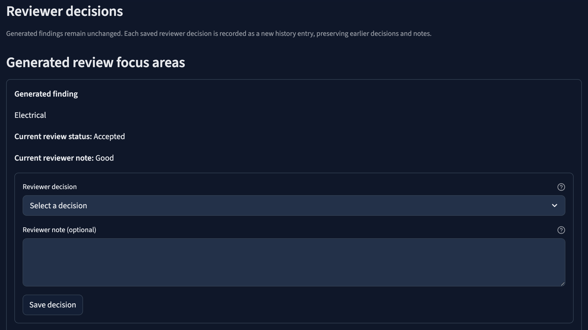
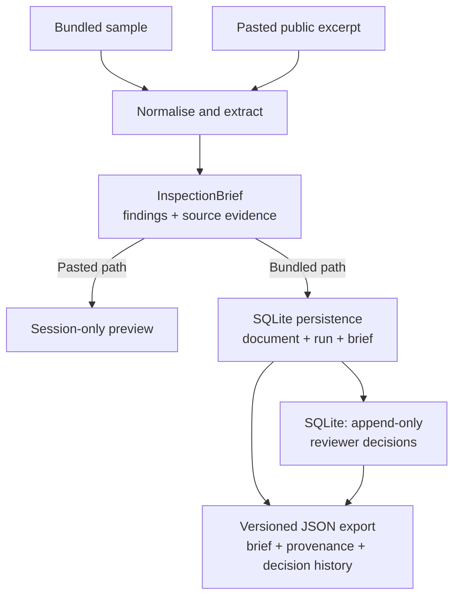

# Tender-to-Inspection Brief

Tender-to-Inspection Brief is a Python and Streamlit reviewer-assistance application that turns public construction tender notices and excerpts into structured, source-traced technical review briefs.

It uses a transparent deterministic keyword baseline to surface technical scopes, information gaps, and follow-up questions. Reviewers verify generated findings against source evidence, record append-only decisions for persisted briefs, and download each persisted brief with its processing provenance and complete reviewer-decision history as versioned JSON. The application supports human technical review; it does not make legal, regulatory, compliance, safety, or engineering decisions.

**Live application:** [tender-inspection-app.streamlit.app](https://tender-inspection-app.streamlit.app)

**Stack:** Python · Streamlit · SQLite · Pydantic · pytest · GitHub Actions


## Key capabilities

- generate structured review briefs from bundled public or synthetic excerpts and preview session-only pasted public text;
- link detected technical domains to source-labelled evidence while presenting information gaps and suggested reviewer questions separately;
- persist documents, processing runs, and immutable generated briefs in SQLite with explicit provenance and preserved processing history;
- record reviewer states and optional notes for generated focus areas and information gaps as append-only decision events;
- export persisted briefs, processing provenance, and complete ordered reviewer-decision history through a deterministic versioned JSON contract;
- run the bundled workflow offline without API keys, model providers, or runtime network services;
- guard behaviour with automated tests and a committed qualitative validation set.

## Reviewer workflow

1. Select one of the persisted bundled samples or paste a short public, non-confidential excerpt for a session-only preview.
2. Inspect the generated summary, technical scopes, potential review focus areas, information gaps, and suggested questions.
3. Verify each generated finding against its source-labelled evidence.
4. For persisted bundled briefs, save `Accepted`, `Rejected`, or `Needs follow-up` decisions with optional notes. Each update appends a new history event rather than changing the generated brief.
5. Download the persisted brief, linked processing provenance, and complete reviewer-decision history as versioned JSON.

The reviewer remains responsible for interpreting the source material and deciding what requires follow-up.



## How it works



`src/pipeline.py` coordinates the bundled processing path:

1. `src/collect/sample_loader.py` loads a bundled sample and parses its source metadata.
2. `src/parse/clean.py` normalises whitespace and encoding.
3. `src/ai/risk_extract.py` applies the deterministic keyword-to-domain baseline and returns an `InspectionBrief`.
4. `src/provenance.py` records the UTC processing time, extractor and brief-schema versions, and a SHA-256 fingerprint of the normalised source text.
5. The processing run and its linked brief are persisted atomically in SQLite.
6. The Streamlit interface displays the latest persisted brief, accepts separate reviewer decisions, and prepares the JSON export.

Material architecture and product decisions, including their trade-offs, are recorded in [`docs/decision_log.md`](docs/decision_log.md).

## Processing and review boundaries

### Generated briefs

The extractor scans normalised text case-insensitively and maps declared terms to technical review domains. The structured `InspectionBrief` contains:

- a neutral summary;
- detected technical scopes;
- potential review focus areas;
- detected information gaps;
- suggested reviewer questions;
- source snippets, matched terms, and approximate line locations;
- fixed `low` baseline confidence and `human_review_required: true` markers.

The rule-based baseline is transparent and reproducible, but it does not provide general semantic or multilingual language understanding. A small targeted set of French construction terms supports the bundled Luxembourg examples.

### Persistence and reviewer decisions

| Record | Responsibility | History boundary |
| --- | --- | --- |
| `documents` | Current source record for a logical document | Complete source-text revisions are not preserved |
| `processing_runs` | Timestamp, extractor and schema versions, and source fingerprint for one run | A new record is stored for each persisted run |
| `briefs` | Structured generated result linked to one exact processing run | Generated briefs remain immutable |
| `reviewer_decisions` | Human-authored state and optional note for one generated target | Every saved change appends a new event |

Reviewer decisions target generated `risk_domain` and `missing_info` items in persisted bundled briefs. Generated review questions are not decision targets. An item with no saved event is displayed as `Unreviewed` without creating a database record.

Existing databases are upgraded additively. Historical briefs without recorded provenance receive explicit legacy metadata rather than inferred current-version values.

### Session-only excerpts

The **Analyse a public excerpt** tab reuses the cleaning, extraction, and brief-rendering path for short pasted text. Pasted content is processed only in the current session and is not persisted or exported. The application does not fetch supplied URLs, scrape websites, parse PDFs, or call an external model or API.

## Versioned JSON export

The **Download review brief (JSON)** action is available for persisted bundled briefs and produces the current export schema, `1.1.0`. Schema `1.0.0` remains available as an explicit compatibility serialisation without reviewer-decision history.

It combines stored document metadata, the exact linked processing run, the complete generated brief with its source evidence, and the complete ordered reviewer-decision history.

The export schema, structured brief schema, and extractor version are separate version domains. They do not advance automatically together.

Serialisation uses sorted keys, two-space indentation, UTF-8-compatible text, and one terminating newline. Repeated serialisation of the same persisted payload is byte-stable. Raw exports from independent runs are not expected to be byte-identical because database identifiers and processing timestamps identify a particular stored execution; automated reproducibility checks compare the stable content after excluding only those run-specific fields.

The export covers one persisted brief, its linked processing run, and its complete reviewer-decision history. It is not a database dump, source-document archive, or complete document-revision history.

## Data sources and validation

Three samples are committed under `data/samples/` and can be processed without network access.

| File | Type | Coverage |
| --- | --- | --- |
| `synthetic_sample_tender_001.txt` | Synthetic fixture | Deterministic offline testing; not a real tender |
| `public_lu_pmp_ctie_001.txt` | Curated public excerpt | Luxembourg public notice 217578-2026; asbestos remediation and selective deconstruction |
| `public_lu_pmp_snhbm_belvaux_001.txt` | Curated public excerpt | Luxembourg PMP reference 2601359; heating, ventilation, electrical, and kitchen works |

The public samples are short manually curated excerpts from public Luxembourg procurement consultations. No scraping was performed and no full tender dossier was committed. Source URLs and reference metadata are retained in the sample headers.

The qualitative validation set at `data/labels/manual_validation_v1.csv` records manually expected domains, extracted domains, match status, taxonomy gaps, and known limitations for the three bundled samples. A regression test compares current extractor output with those declared expectations.

All three current samples record a `match` against their expected domains. Here, `match` means agreement with the declared expectations for that sample; it is not a statistical accuracy measure. The dataset is too small to support precision, recall, F1, or broad language-coverage claims.


## Run locally

GitHub Actions validates the project on Python 3.11, 3.12, and 3.13.

From the repository root, create and activate a virtual environment, then install the pinned dependencies:

```bash
python3 -m venv .venv
source .venv/bin/activate
python -m pip install -r requirements.txt
```

Run the bundled pipeline and start the application:

```bash
python -m src.pipeline
python -m streamlit run src/app/streamlit_app.py
```

The pipeline creates or updates `data/processed/tender_inspection.db`. The application can also initialise the bundled samples automatically when the generated database is absent or incomplete.

Process one sample explicitly:

```bash
python -m src.pipeline \
  --sample data/samples/synthetic_sample_tender_001.txt
```

## Checks

Run the test suite:

```bash
python -m pytest -q
```

Compile the Python sources and tests:

```bash
python -m compileall -q src tests
```

GitHub Actions runs compilation, the bundled-sample pipeline, and pytest on each supported Python version for pull requests and pushes to `main`.

## Current limitations

- Extraction is a deterministic keyword-to-domain baseline rather than semantic or contextual language understanding.
- The declared taxonomy cannot identify technical domains or paraphrases that it does not cover.
- French support is limited to targeted terminology used by the bundled samples; French missing-information signals are not currently detected.
- Evidence locations are approximate line references rather than page, section, paragraph, or drawing references.
- The public samples are short curated excerpts, and the three-sample validation set does not support statistical accuracy claims.
- Processing history is preserved, but complete historical source-text revisions are not.
- Reviewer decisions are limited to generated focus areas and information gaps in persisted bundled briefs.
- Reviewer identity, authentication, simultaneous multi-user editing, and session-only excerpt decisions are not implemented.
- PDF ingestion, URL fetching, scraping, external-service integration, and model-based extraction are not implemented.

These boundaries should not be interpreted as document management, BIM coordination, site-inspection records, defect tracking, or regulatory assessment functionality.

## Security

Report suspected vulnerabilities through GitHub Private Vulnerability Reporting rather than a public issue. See [`SECURITY.md`](SECURITY.md) for details.

## Releases

See [GitHub Releases](https://github.com/NikolayAir/tender-inspection-pipeline/releases) for versioned release notes.

## License

Tender-to-Inspection Brief is available under the [MIT License](LICENSE).

The MIT License applies to this repository's original source code and documentation. Curated public procurement excerpts under `data/samples/` are not covered by the MIT License and retain their recorded source attribution.
