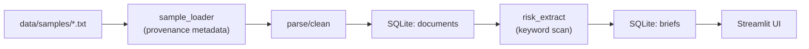

# Tender-to-Inspection Brief

A small Building Intelligence MVP that turns public construction tender documents into evidence-based technical-risk inspection briefs for a SECO-style technical reviewer.

This is a reviewer-assistance prototype. It supports human technical review; it does not make legal, compliance, safety, regulatory, or engineering decisions.

## Problem and user

Public construction tender documents contain useful technical signals — declared scopes, site constraints, referenced surveys, missing attachments — but scanning them manually before an inspection or technical review is slow and inconsistent. A reviewer can miss a flagged asbestos survey, an absent structural drawing, or an undeclared drainage scope buried in a long notice.

This tool helps a technical inspection coordinator or reviewer prepare a structured first-pass brief from a tender document. It identifies declared technical domains, highlights missing information, suggests review questions, and ties every finding back to a source snippet. The reviewer then decides what requires follow-up; the tool does not decide for them.

## SECO relevance

SECO's mandate covers independent technical control, construction inspections, risk prevention, quality and safety assurance, and compliance awareness across the building lifecycle. The workflows this MVP is most relevant to:

- **Early-stage technical due diligence:** structured briefing before a first inspection visit.
- **Risk-domain identification:** flagging HVAC, electrical, fire safety, asbestos, structural, and similar scopes that need dedicated review.
- **Building logbook / technical traceability:** the pattern of linking findings to source documents is the foundation of a building logbook approach.
- **Reviewer workflow support:** reducing the time a coordinator spends manually scanning notices before engaging specialists.

The tool is scoped as a reviewer-assistance aid, not an automated technical control system.

## Data sources

Two bundled samples are committed under `data/samples/`. Both are loaded by `python -m src.pipeline` with no network access required.

| File | Type | Source |
|---|---|---|
| `synthetic_sample_tender_001.txt` | Synthetic (hand-written) | Offline skeleton testing only; not a real tender. |
| `public_lu_pmp_ctie_001.txt` | Manually curated public notice | Luxembourg Public Procurement Portal / TED-linked public notice. Buyer: Administration des bâtiments publics. TED notice ref: 217578-2026. Short excerpt only; full consultation at `SOURCE_URL` in the file header. |

The public sample is a short curated excerpt of a real Luxembourg public procurement consultation (asbestos remediation and selective deconstruction of the former CTIE building). It is included as a reproducible real-data example. No scraping was performed; the excerpt was manually curated from the official PMP consultation page. It demonstrates source traceability on a realistic public procurement input.

The synthetic sample is retained as the default sample for offline unit tests.

## Data pipeline

The pipeline runs as a single Python module (`src/pipeline.py`) with no external services or network access required.

1. **Load** — `src/collect/sample_loader.py` reads a bundled sample from `data/samples/`. Comment-header lines (`# KEY: value`) carry provenance metadata: `SOURCE`, `SOURCE_URL`, `TED_NOTICE`, `REFERENCE`. These are parsed and stored alongside the document.
2. **Clean** — `src/parse/clean.py` normalises whitespace and encoding.
3. **Store document** — The cleaned record and provenance metadata are written to the `documents` table in a local SQLite database (`data/processed/seco.db`). Re-runs are idempotent; a document is not duplicated if it already exists.
4. **Extract** — `src/ai/risk_extract.py` runs a keyword scan over the cleaned text and returns a structured `InspectionBrief` (Pydantic model).
5. **Store brief** — The brief is written to the `briefs` table, linked to the document by `document_id`.
6. **Display** — The Streamlit UI reads from SQLite and presents the brief alongside source-labelled evidence snippets.



## Extraction and evidence traceability

**What the extractor is:** `src/ai/risk_extract.py` is a transparent, deterministic keyword-to-domain dictionary. It is not AI or NLP. It scans the cleaned text case-insensitively, maps matched terms to review domains (e.g. `"fire"` → Fire safety, `"amiant"` → Asbestos / hazardous materials), and returns a structured `InspectionBrief`.

**What it returns:**

- `risk_domains` — list of triggered review domains.
- `evidence` — for each domain: the source line, matched term, and approximate line number.
- `missing_info` — sentences matching phrases like "not attached" or "must be requested separately".
- `review_questions` — one suggested question per detected domain.
- `confidence = "low"` and `human_review_required = True` on every brief.

**French keyword extension:** A small set of French construction terms was added specifically for the curated Luxembourg PMP/CTIE sample (asbestos, structural deconstruction, remediation, materials reuse). This is not general multilingual NLP; it is a narrow targeted extension for one real-data sample.

**Evidence traceability:** Every finding is tied to the source text. The `EvidenceSnippet` model records the matched line, the triggering keyword, and an approximate location (`line N`). The Streamlit UI displays evidence labelled by source type (synthetic vs. real public notice) alongside the brief.

**What the extractor cannot do:** semantic or contextual understanding; detection of risks not covered by its declared keyword list; sub-document location (page, section, paragraph); French-language missing-information signals; multi-document reasoning.

## Validation

A small manual validation sample is committed at `data/labels/manual_validation_v1.csv`.

It covers 2 manually reviewed sample rows (one synthetic, one real public excerpt). For each row, the manually expected risk domains are compared against the extractor output and a match status (`match` / `partial` / `mismatch`) is recorded alongside notes on taxonomy gaps and known limitations.

This is qualitative validation of a transparent keyword placeholder, not statistical evaluation or ML benchmarking. No precision, recall, or F1 figures are reported; the sample size does not support them.

Key findings from the validation:

- Both samples produce a `match` against their declared expected domains.
- Structural, energy, waste-disposal, and site-logistics signals present in the source texts fall outside the extractor's declared taxonomy and are documented as known taxonomy gaps.
- The missing-info scanner uses English phrases only; French-language information-gap signals are a known out-of-taxonomy limitation.

Human review is always required. The extractor is a reviewer-assistance placeholder, not a compliance or safety decision tool.

## Technical decisions and trade-offs

Full reasoning is in `docs/decision_log.md`. Summary:

**Reviewer-assistance framing over generic summariser.** SECO's work is about independent technical control and construction inspections, not generic document summarisation. The brief is structured around SECO-relevant domains, evidence traceability, and reviewer questions.

**Rule-based extractor before any optional LLM dependency.** The first version must run fully offline without API keys. A transparent keyword extractor is less capable but fully reproducible, testable, and straightforward to validate. An LLM-based step is a later option, not a requirement.

**Hybrid sample approach.** The synthetic sample keeps all unit tests deterministic and fully offline. The real public Luxembourg PMP notice adds credibility and demonstrates source traceability on a real procurement input without requiring scraping or network access at demo time.

**SQLite + Pydantic.** Simple, typed, and zero-infrastructure. Every record is traceable by `document_id`. The data model is easy to explain, extend, and migrate.

## Why Streamlit

React is SECO's preferred production stack, and a React frontend against a lightweight API would be the natural production migration. Streamlit was chosen for the MVP because the challenge prioritises a finished, reproducible prototype: the primary engineering work is in the data pipeline, extraction logic, evidence traceability, and validation approach, not the frontend. Streamlit lets all of that be demonstrated with minimal frontend overhead. The workflow, data model, and user value should be validated before committing to a production frontend.

## What would be productionized tomorrow

**Worth keeping from the prototype:**

- Source traceability pattern: every document carries `source`, `source_url`, and provenance metadata; every finding links back to a source snippet.
- Structured brief schema (`InspectionBrief` Pydantic model): clean separation of domains, evidence, questions, confidence, and human-review flag.
- SQLite/Pydantic data model pattern: straightforward to migrate to Postgres while keeping the same schema.
- Validation habit: a CSV of manually reviewed expected vs. extracted outputs, updated when the extractor changes.
- Streamlit demo workflow: useful as an internal prototype demonstration and stakeholder feedback tool even after a production frontend is built.

**Would need production work next:**

- **Real data ingestion:** replace static sample files with a documented API, official export, or approved access route to Luxembourg PMP, TED, or other e-procurement platforms.
- **Extraction:** evaluate and, if useful, augment or replace the keyword baseline with structured extraction under validation (e.g. a well-prompted LLM with structured JSON output and prompt versioning).
- **Authentication and audit logging:** required before any reviewer uses the tool on real project data.
- **Reviewer workflow state:** accept/reject/annotate findings; reviewer notes fed back into the validation dataset.
- **Deployment:** package the app reproducibly and serve it in an approved environment; move from local SQLite to a managed database when multi-user use is needed.
- **Frontend:** migrate to React against a lightweight API.

## What would be replaced or thrown away

- **The keyword extractor:** it is a transparent placeholder. The taxonomy shape, evidence-tracing structure, and confidence/human-review flags are worth keeping; the keyword dictionary itself would be replaced by a stronger extraction method once validated.
- **The missing-info phrase list:** too brittle for production. Phrase matching on whitespace-normalised text misses paraphrased gaps and cross-sentence signals.
- **The synthetic sample as a primary fixture:** once a live data feed exists, its only remaining role is as a deterministic offline test fixture — which is still a valid use.
- **The Streamlit UI:** replaced by a React frontend in production, as noted above.

## Three-month roadmap

**Month 1 — Real data and stronger extraction**

- Connect to a documented procurement data source, official export, or approved access route for Luxembourg PMP / TED data.
- Add PDF text extraction via `pdfplumber` for uploaded tender dossiers.
- Evaluate augmenting or replacing the keyword extractor with structured extraction under validation (structured JSON output, prompt versioning, comparison against the existing validation CSV).

**Month 2 — Reviewer workflow**

- Add reviewer annotation: accept, reject, or flag a finding with a note.
- Persist reviewer labels; use them to extend the validation dataset.
- Migrate UI to React against a lightweight API.
- Add authentication and audit logging.

**Month 3 — Multi-document projects and building logbook**

- Group multiple documents (tender, inspection report, certificate) under a single project record.
- Aggregate a risk profile across documents: the foundation of a building logbook approach.
- Evaluate extraction quality against the growing labelled dataset; iterate on the taxonomy or extraction method.

## How to run

Run from the repository root (Windows / PowerShell):

```powershell
pip install -r requirements.txt
python -m src.pipeline                 # ingest all bundled samples -> SQLite -> placeholder briefs
streamlit run src/app/streamlit_app.py # view the briefs
pytest -q                              # smoke tests and validation regression
```

Run a single sample file explicitly:

```powershell
python -m src.pipeline --sample data/samples/synthetic_sample_tender_001.txt
```

The project runs fully offline on the bundled sample data; no network access or API key is required.

## Known limitations

- Extraction is a transparent keyword-based placeholder, not real AI/NLP.
- The keyword extractor is primarily English. The French extension covers 10 terms across 4 domains, targeting the curated CTIE sample only; it is not general multilingual NLP. False positives are possible on other French documents.
- The public sample is a short excerpt only; it does not represent the full tender dossier.
- Evidence location is at the line level; page, section, or paragraph references are not yet supported.
- The missing-info scanner uses English phrases only; French-language information-gap signals are not detected.
- No authentication, multi-user support, or persistent reviewer feedback loop.
- No PDF parsing in the current version; text samples only.
- The Streamlit UI is a demonstration prototype; it is not production-hardened.
- The validation sample covers 2 documents and is qualitative only; it does not support statistical accuracy claims.
